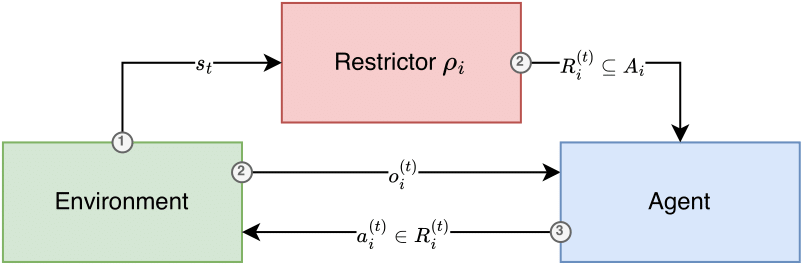

Framework
=========

DRAMA extends the classic agent-environment loop with a restrictor for complex and dynamic action space restrictions.
The framework is compatible with any existing PettingZoo environment and may seamlessly extend the action spaces with
restrictions.

The updated loop is built with three new fundamental entities: The restriction wrapper, restriction representations,
and restriction learning agents.

Restrictions
------------

Restrictions are Gymnasium Spaces and sub-classes of ``Restriction``.
They may represent any subset of an agent's static action space, referred to as the base space.
DRAMA comes with discrete restrictions in form of sets and vectors, as well as continuous restrictions as interval
unions and buckets of equal width. Multi-dimensional restrictions can be implemented with predicates.

Restrictors
-----------

The restrictor is a regular agent but with restrictions as actions. The observation to compute the allowed subsets is
not necessarily linked to the agent observations. The action space comprises of all possible restrictions for a given
agent's action space and the reward can be constructed with any information in the environment.

Restriction Wrapper
-------------------

The wrapper manages the interaction between the environment, agents, and restrictors. Prior to querying an agent, the
wrapper requests a restriction from the corresponding restrictor and then passes this restriction to the agent.
Multiple restrictors can be defined to accommodate, for instance, agents with different action spaces.
